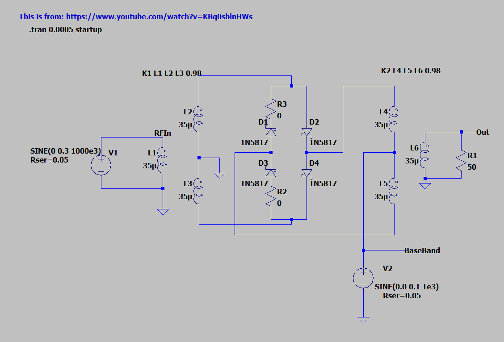
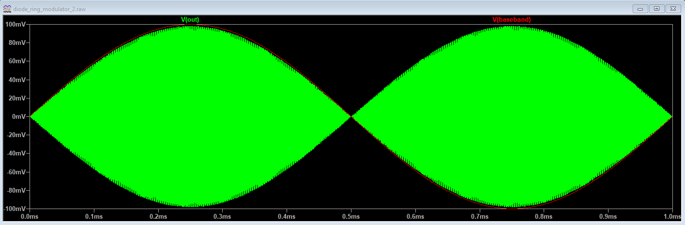

# Diode ring modulator
I want to try to get a diode ring modulator working.

ordered:  
26 AWG magnet wire  
1N5817 diodes  
1N5711 diodes
FT37-43 toroids for transformers  

I built the circuit after watching Youtube videos.

The screenshot is updated from what I had been using originally. The inductance of the transformers was 1 mH, but I wound a transformer and measured the inductance from 1 - 50 MHZ using my NanoVNA, and the windoings are ~35 uH.  

The simulation looks ok:  

  

If you put a DC offset on the Baseband input, you can make it look like just "regular" AM.   

I have an Si5351 connected to a Pi Pico. It's running the adafruit example code. It's putting out 13.55 MHz on clock 1. I'm using that as RF input to mixers. It's 3 Vpp (1.5 V above ground) square wave.

I'm using the signal generator as the "local oscillator" or the base band input. ("Base band" means near 0 Hz so this would be like audio input.)

For AF input,   
RF_in = the intermediate frequency, like 9 MHz or the 13.55 MHz from the Si5351  
LO = audio frequency from a mic maybe or 0.3 - 3 kHz from the signal generator  
IF_out = f_RF_in +/- f_LO; this is the modulated output   

For frequency up-conversion,  
RF_in = The modulated output from the earlier mixing stage - like the 9 MHz modulated with the AF  
LO =  RF from the Si5351 that is tuned to put the output in the correct band. Maybe, 28.3 MHz to 28.5 MHz for 10m. If the IF is 9MHz, the f_LO = 19.3 MHz  
IF_out = f_RF_in +/- f_LO  

I have received a couple ADE-6's that I ordered from amazon. I'm comparing it to the mixer that I made.  

Homebrew mixer:  
The AF input is signal generator at frequency of 0.3 to 3 kHz.  
Amplitude will be varied. The mixers are sensitive to the voltage input.

