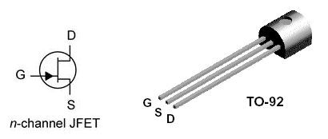
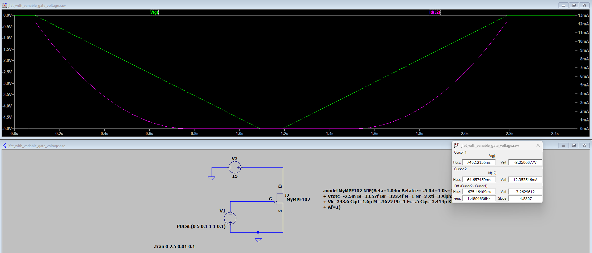

# Understanding JFETs

I want to learn more about JFETs and then use one to make an AM modulator circuit. I already made the circuit, but I still have questions about biasing the JFET to make it work as a modulator and not as a "summer". This is meant to figure this out.

I'm using LTSpice to model the circuit before I build anything.

I'm just following labs on JFETs that I've found online. I had been using one from MIT (I think) that I liked, but can't find it! I've started using this one today:

https://www.nhn.ou.edu/~bumm/ELAB/Labs/lab11_FET_Lab_v1_4_0.html

## Effect of gate voltage on Id
JFETs are voltage controlled devices, so you apply a voltage to the gate and see what happens. You need to keep the gate voltage more negative than the source voltage for a n-type JFET.
* The n-type has negative carriers. The gate voltage "pinches off" the current flow from drain to source.
* For p-type, the charge carriers are positive, so you need a positive voltage

I'm using an MPF102 which is an n-channel JFET. I found a LTSpice model for this JFET here: https://groups.io/g/LTspice/topic/looking_for_mpf102_ltspice/50184855

After Vd gets to 3.2 V, the drain current sits at 12 mA. This is the 'on' condition, and the current is Idss. Is this also called saturation?

From the datasheet:

## Vary the gate voltage
I made a model that varies the voltage on the gate keeping 15 V on the drain.

At -3.2 V the drain current (Id) is 0 mA.   
At Vg = 0V, Id = 12 mA as expected.

## The modulator
For the modulator to work, you'd want Vds &lt; 3.2V, and Vgs &lt; 3.2V.

