# Log for SSB transmitter
I'd like to build a QRP single sideband transmitter. I've been watching YouTube videos and reading stuff online.

From the ARRL handbook that I have, here's a block diagram:  
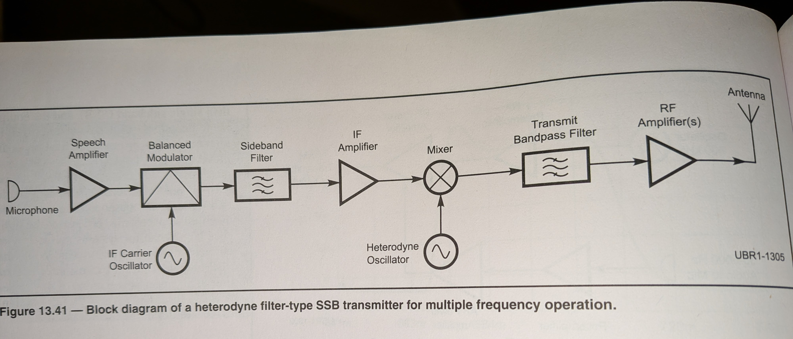

2-16-26  
I have built a ring diode double sideband suppressed carrier mixer, and I bought a couple from Amazon. They behave pretty similarly. I think the biggest difference is the effects of input voltage. I've made a log of info in the diode_ring_modulator directory.

I have an Si5351a from Amazon for the oscillators. I'm using the Adafruit circuit python example code to set the registers in the chip, and I modified the rfzero code for calculating the Feedback and Output Multisynth Dividers  
https://rfzero.net/tutorials/si5351a/

I bought a crystal QER filter (Quasi Equi-Ripple) from diyrf.com off of ebay. I built that yesterday. The pass band seems narrow enough especially if measured betwen 3dB points. Lots of ripple in the pass band though! I will need to make an impedance matching circuit for it. The information that I got with the filter says that the input impedance is approxiomately 250 Ohms. I'm not sure how that is measured, though. When I calibrate the nanovna to 8885 kHz to 9005 kHz and look at the smith chart, the max Ohms measured is 130 Ohms with 177 nH inductance. (The lowest is only about 20 Ohms though - that's how much ripple there is.) 
Calculating the reactance for that gives ~130 Ohms. (It would need to be a lot more inductance to see a significant change from just measured R.)

The impedance matching can be done with   
* just a series resistor (I think, because I want to go from 50 Ohms to 130 Ohms)
* an LC network (L pad, https://electronics.stackexchange.com/questions/705995/why-dont-people-always-use-50-ohm-resistors-when-matching-impedances  
or  
https://toroids.info/FT37-43.php).   
According to the calculator at that toroids site, the L stays pretty constant, and then you can tune with the capacitance. Maybe this is a good use of one of those variable caps?
* an impedance matching transformer (https://www.n1fd.org/2024/05/21/crystal-filter/)

I think that last link talks about obtaining the input impedance of the filter by putting a potentiometer in the circuit and finding what value gives the least pass band ripple in your nanovna. I don't know if I have a 1k pot though  

Maybe I have a 1k pot somewhere....

Looking a little more at the inductance from the wire-wound toroid that I want to use for the impedance matching LC network.  

Using the calculator on that toroids web page, 2.3 turns on the FT37-43 toroid should give 1.89 uH. I used the nanovna to measure an inductor that I wound that way and I get 0.694 uH at 9 MHz
This is what my measurement jig looks like for this. (I kept the original two turns on the toroid.)
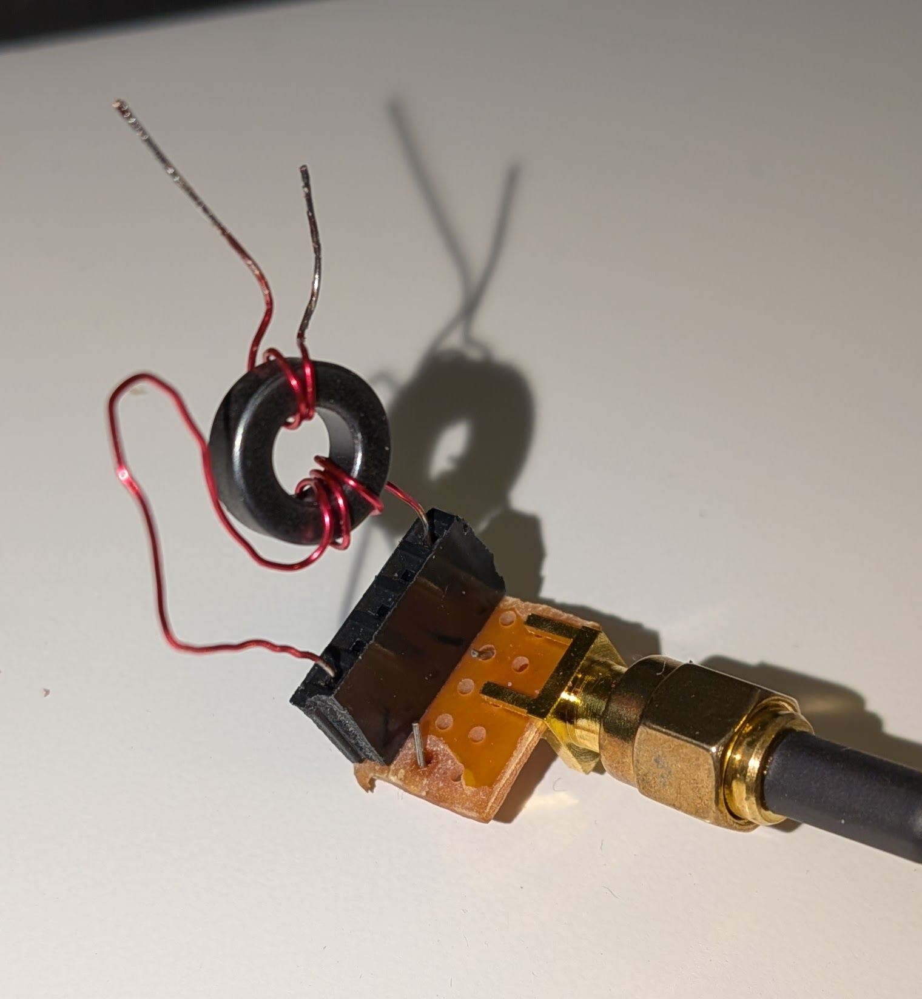

| turns | Inductance (uH) | difference (uH) |
| :-----: | :------------:| :-----: |
|  2    |   0.694         | |
|  3    |   1.55          | 0.856 |
|  4    |   2.64          | 1.09  |
|  5    |   4.07          | 1.43  |
|  6    |   5.74          | 1.67  |
|  7    |    7.73         | 1.99  |

The winding on the toroid is pretty sparse. I wonder if as the toroid is more uniformly wound if the increase in inductance per winding will stabilize.

3 windings gets the inductance closest to 1.89 uH.

I soldered in two inductors with 3 turns of wire with 220 pF capacitors.  

I still see 6.5 dB of ripple in the pass band of the filter.

3-3-26
I changed how I made the inductors for the impedance matching circuit for the crystal filter. I've wound magnet wire on the cardboard cylinder from Loula's poop bags. I wound 20 turns onto the cylinder and then connected it to the NanoVNA measurement jig. I could take a measurement of the inductance at the same time that I moved the wire windings on the tube. When I measured the correct inductance, I hot glued the wire in place. It was a really easy way to make these inductors. It's pretty easy to peel the hot glue off if you make a mistake, too.  
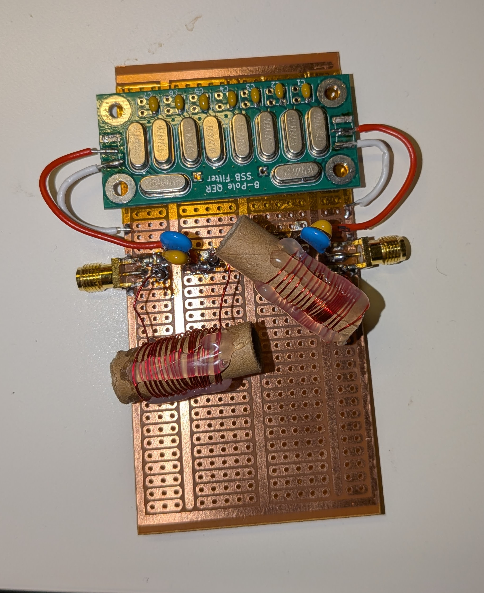

I put two capacitors in parallel to get the capacitance that was calculated.

I tried this circuit with two series 500 Ohm pots at input and output. This eliminates pass band ripple but results in -17dB of insertion loss. (The resistance values that I found were 220 - 250 Ohms.) The LC impedance matching reduces that ripple almost as much, but there is only 2dB of insertion loss.

Links for impedance matching that I found useful:
https://www.n1fd.org/2024/05/21/crystal-filter/

https://passive-components.eu/impedance-matching-with-rf-lc-circuits/

https://circuitcellar.com/research-design-hub/basics-of-design/impedance-matching-fundamentals/

I used the calculator at toroids.info to calculate the inductance and capacitance.  
https://toroids.info/

OR

Another LC calculator for impedance matching  
https://www.leleivre.com/rf_lcmatch.html

Which of the LC networks do you pick?
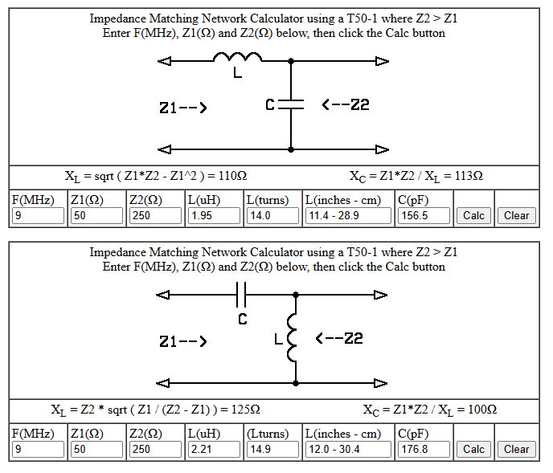

There is a discrepancy between the two calculators:

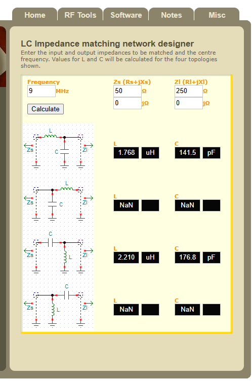

The "series-L, parallel-C" circuits have different L and C values. ????

I used the values in the toroids.info calculator for the crystal filter.

3-14-26
I downloaded NanoVNA Saver, and I took data from the crystal filter.

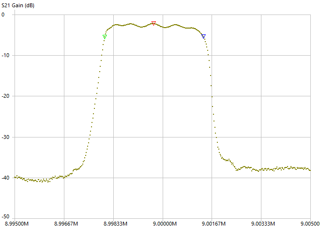

The software has analysis for a bandwitdth filter.
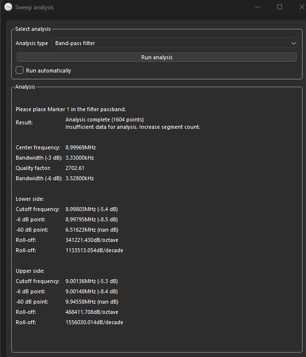

I'm not sure why it says that there is insufficient data. I started with 1 "segment" of 401 points, and then increased it to 4 segments. It still said insufficient data. The calculated parameters appear to be ok though

So this filter is 3.3 kHz at the -3dB points. You can easily see that the upper skirt has a sharper cut off than the lower. This filter would be best used for LSB. I will try USB, but maybe I could do the "mirroring" that I've seen mentioned.
For USB, I should put the IF at:

center frequency - bandwidth/2  
8.99969 MHz - 3.33/2 kHz = 8.99803 MHz

## Ring diode mixer
Here's the spectrum from my ring diode mixer.  
RF Input: 3.3 V peak-to-peak, 8.9975 MHz  
Baseband input: 130 mV peak-to-peak, 900 Hz  
There is 26 dB of attenuators in front of the RSP1B input. The spec on the input power for the RSP1B is 0 dBm continuous (i.e. 1 mW) and 10 dBm sporadic.
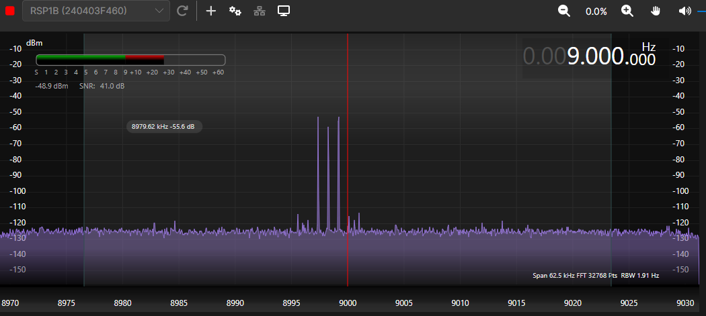

Compare that to the ADE-6 that I ordered from Amazon.  
The board has inputs RF_LO, RF_IN, RF_IF. These don't really correspond to the inputs on the data sheet which are LO, IF, RF  

Here's part of the datasheet for the ADE-6  
  
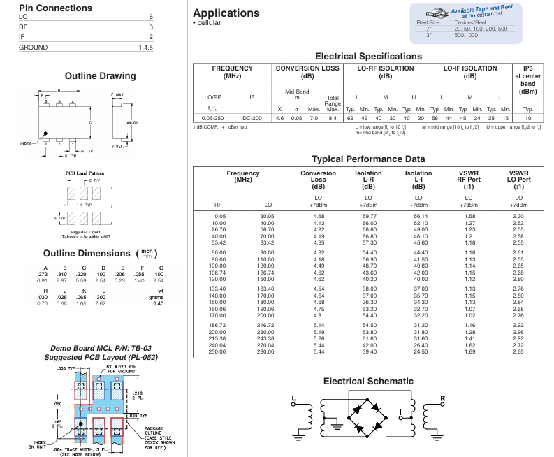

Putting a multimeter on the RF_IF input and it looks like diodes. The diode tester gives 0.2 V to ground and the ohm meter gives 1.113kOhms. 

So,
| board | datasheet | Connection|
| :---: | :------:| :----: |
| RF_IF | IF | Low frequency from signal generator |
| RF_LO | LO | ~9 MHz from Si 5351 |
| RF_IN | RF | Output to spectrum analyzer (RSP1B) |

Hooking up the ADE-6 board, this is what I see on the RSP1B. The inputs are the same as above for my own ring diode mixer.  

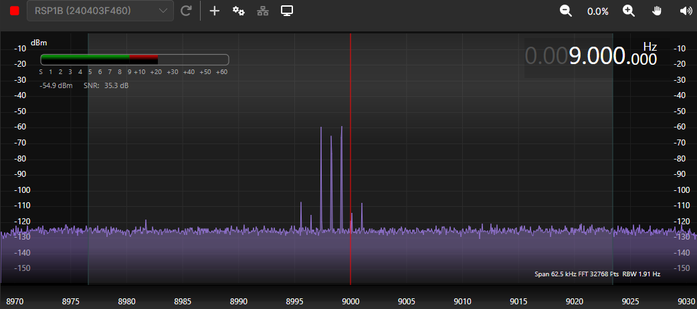

The two spectra are very similar. The homebrew mixer has -52dBm for the side bands and the ADE-6 is -60 dBm for them.  
The carrier is -8 dBm down from the sidebands for both.  
I was thinking that the carrier wasn't suppressed very much in the homebrew mixer, but it's similar. Maybe, it's suppressed a little more in mine.  
There are higher frequency sidebands from both mixers, but the homebrew one suppresses them more.  

I made another ring diode mixer, so I've hooked that up. It is actually better than the other two! I thought it was not good before.  

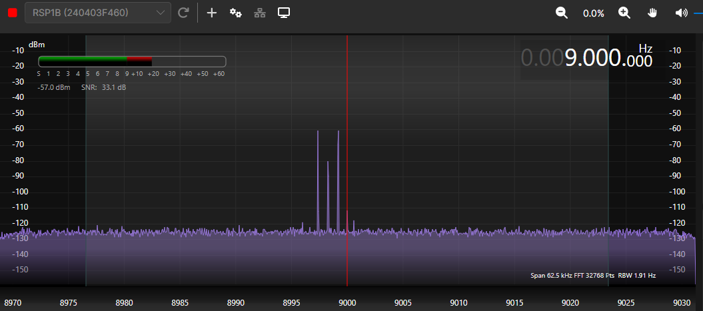   

There are no "harmonic" sidebands, and the carrier is suppressed more - by about 20 dB. 

I had a capacitor at the input of the baseband. If I bypass that cap, the mixer is even better.  

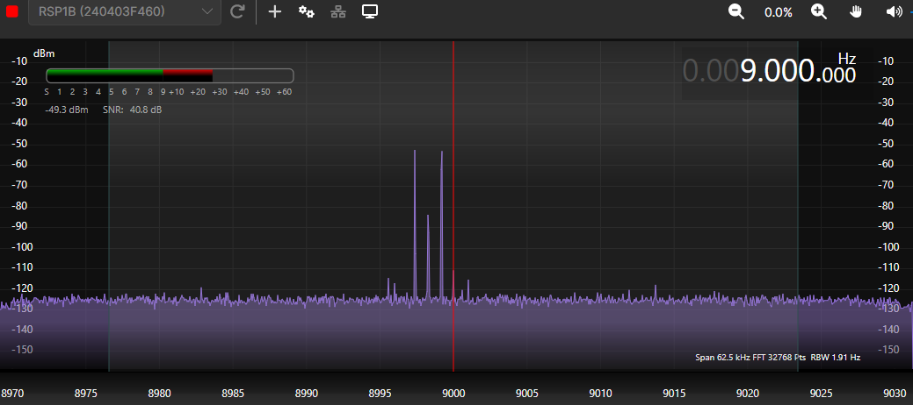

3-15-26
I used some bare copper circuit board to build the second homebrew ring mixer, and the first one I used some of the patterned copper protoboard. Maybe the build is the cause for the difference between the two?

I took the second homebrew diode ring mixer apart and rebuilt it on the same protoboard that I used for the first one.  
The carrier suppression and the sidebands are pretty much the same as what they were for the build on the bare copper board.

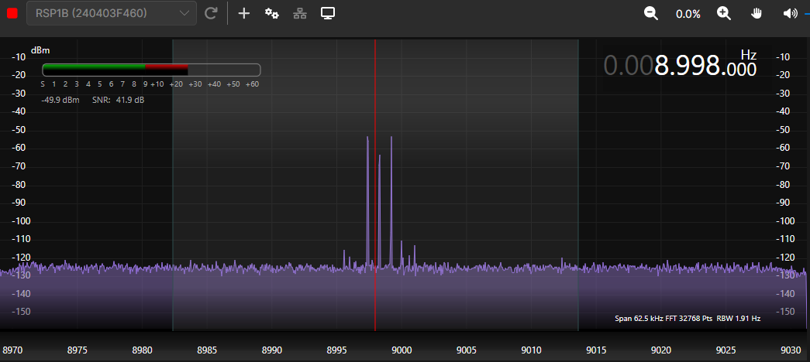

For the second mixer, I tried to be picky in how I selected the diodes. I used two multimeters to pick the diodes - one set to diode measurement mode and the other was used to measure current. For the first mixer, I just selected based on the diode mode voltage measurement. I would think that the diodes chosen for mixer 2 are adequately similar, so maybe the issue is the transformers? 

I wound two more transformers. I tried to make sure that I had the same number of twists on each set of three wires. I would use the yellow wire and it seemed to cross over the wire bundle every 12 to 15 mm. 

Measuring the inductance at 9 MHz for each winding

| Wire | Transformer 1 | Transformer 2 |
|:---: | :---------:|:-----------:|
|yellow|  2.84 uH  |   2.83 uH   |
|red 1 |  2.85 uH  |  2.83 uH   |
|red 2 |  2.84 uH  |  2.82 uH   |

I wired these up, and the result is basically the same as before. I think the transformers are pretty similar, so maybe it's the diodes???
Here's the spectrum analyzer signal for the new transformer mixer. Only the diodes are the same now.

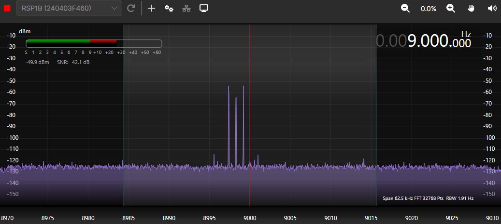

3-16-26
I wanted to select four more diodes for the ring mixer to try to reproduce the good results on the first one. I had to order more IN5817's because I can't find the other package. Arg.

I just used the Fnirsi diode DMM's diode measuring function. I measured a bunch and got some that measured 0.219V and some that measured 0.220 V. I selected four 0.219 V diodes, and put them in the ring diode circuit that I've been trying to make more like the first one that I built.

After I desoldered the existing diodes, I measured them too. They are not the same. two were 0.202 V and the other two were lower, like 0.199 and 0.198.

With the four new diodes the mixer is better according to the RSP1B "spectrum analyzer".
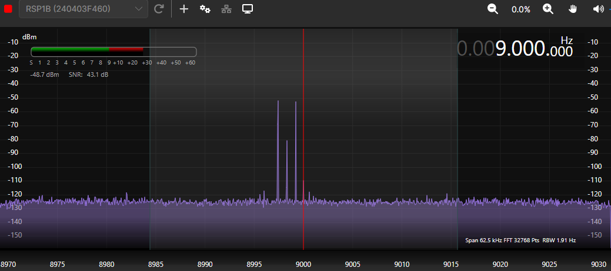

It has about -29dB from the sidebands to the carrier, so the issue was that the diodes for the ring mixer #2 weren't matched very well.   
This also shows that just using the diode measuring function of a DMM is good enough for selecting diodes for the mixer. Yay!

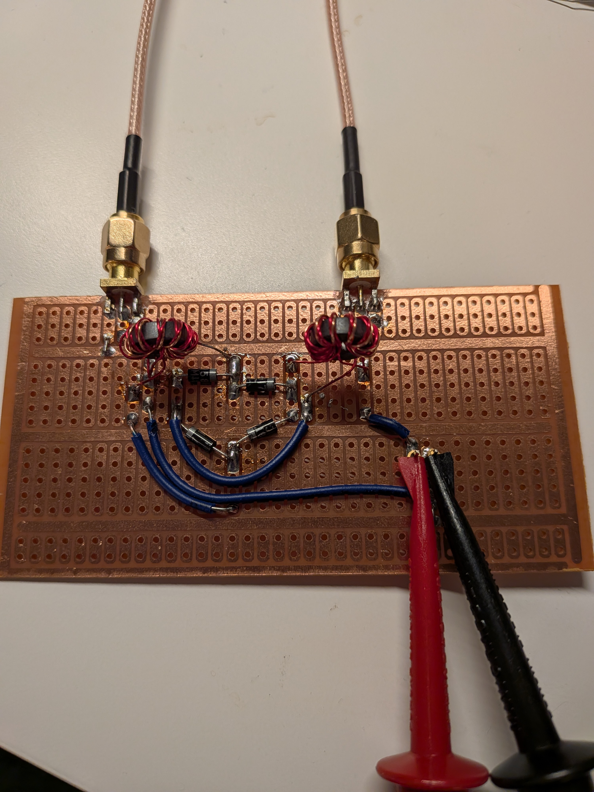

3-21-26  
I connected the microphone to the mixer. There is a problem in that the mixer basically shorts the mic output to ground. Maybe I need to make an op-amp buffer to make the input to the mixer look like a high impedance? Or use an emitter follower as shown here: https://www.youtube.com/watch?v=1wMqNRvMUsY
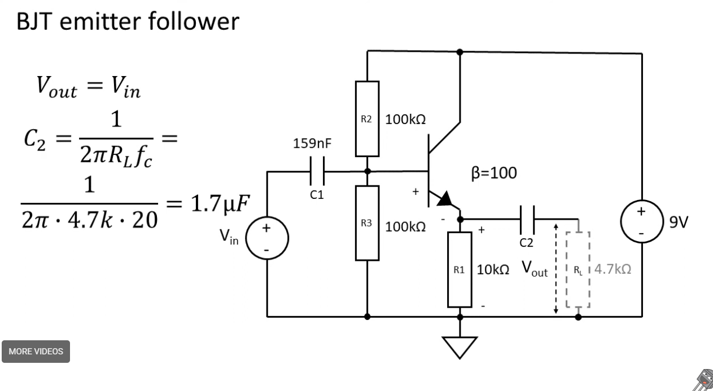

I looked at the mixers that I've gotten from surplus shed, and I found their data sheets on line. They are Vari-L CM-1 mixers. I wonder if they are better than the ADE-6 that I bought from Amazon?

I looked at the power output in the upper side band from the mixer. It looks like 0.002 mW, so only 2 uW (-27 dBm). This is why it makes sense to put an amplifier between the mixer output and the next mixer. I bought a Termination Insensitive Amplifier (TIA) for this purpose from Mostly DIY RF. (It's bidirectional, so I could use it in a transceiver at some point if I want to.)

The Linear amplifier that I got from QRP Labs looks like it will amplify a -7dBm signal to 10W, so the output of the second mixer only needs to be -7dBm (0.2 mW). There's a plot in the pdf build documentation that shows the spectrum analyzer output. That plot shows that the TG is -7dBm. TG is Tracking Generator which is used to sweep the frequency of a spectrum analyzer when testing an amplifier.

If I want to look at the output of this amplifier with the RSP1B, I'm going to need a pretty serious attenuator. I looked at amazon and a 50 W RF attenuator for -50 dB is about $35. Maybe get that? I can't find a 20W or 25 W 50dB attenuator.

3-28-26
I think I have the circuit that I can use so that the microphone will drive the coil on the mixer. It's an emitter follower with a 50 Ohm resistor in series with the inductor of the mixer. I measured the output of the microphone with the gain turned all the way down - minimum gain is with the pot on the mic board turned all the wa clockwise (as you're looking at the pot). When I talk into the mic, the peaks are about 100 mV.

I modeled it in LTSpice. The schematic is called emitter_follower_mic_audio.asc.  
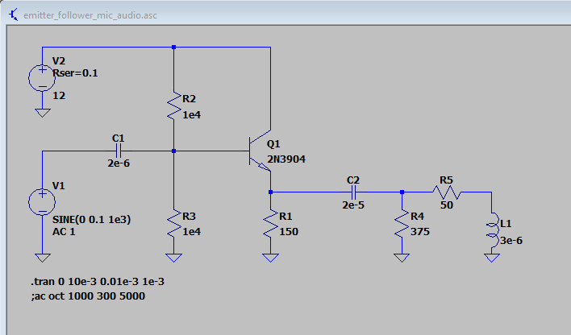  

I used 3e-6 Henries for the inductor since that's what I measured with the VNA - that was at 9 MHz though...  

I made a spreadsheet to help pick the component values: emitter_follower_9MHz&1000kHz.ods. I followed the YouTube video whose link is above for help in designing it.  
(I mistakenly designed if for 9 MHz, but then I remembered I needed it for the mic.)

This is a current gain device. I can make LTSpice plot the voltage gain as a function of frequency, but I didn't do that for the current gain.  
Instead, I just made a chart in that spreadsheet, where I ran the LTSpice simulation for 300 Hz and 1000Hz and I measured the currents and voltages off the plots. I think the results are ok.  

